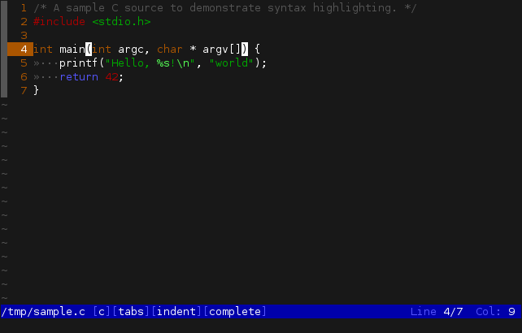
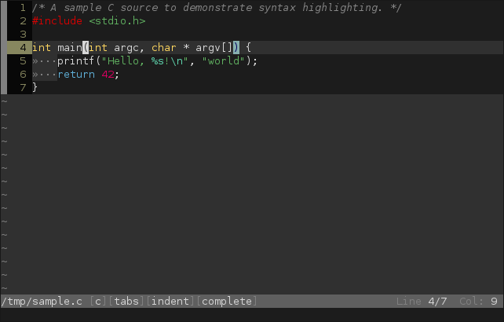
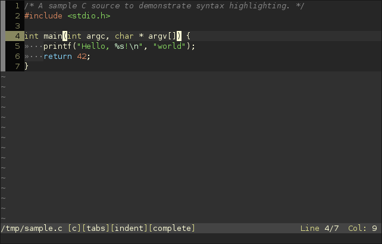
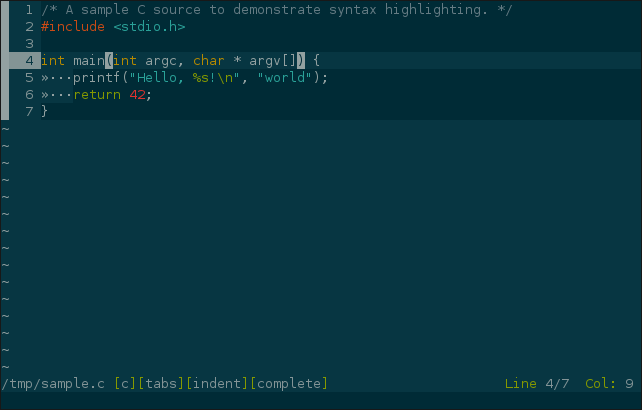
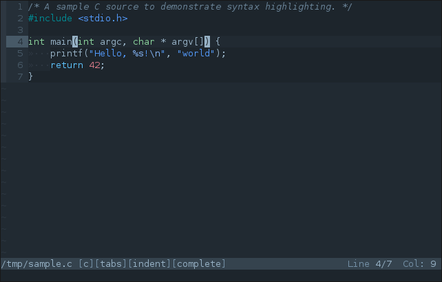
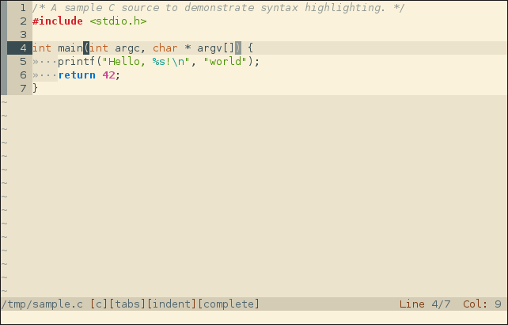

# Bim - A Text Editor

Bim is a terminal text editor with syntax highlighting.

Inspired by Vim (one might say a Bad Imitation) and featuring similar mode-based editing, Bim was originally written for ToaruOS, but it has also been tested in Linux, Sortix, FreeBSD, and macOS.

## Goals / Purpose

Bim is intended as the included text editor in ToaruOS, a hobby operating system built from scratch.

Bim aims to be lightweight and featureful with no external dependencies, providing a modern editing experience in a single fully-encapsulated binary.

## Features

- Vim-like modal interactions.
- Arrow-key and traditional vi `hjkl` navigation.
- Syntax highlighting (currently for C/C++, Python, Makefiles, Java, Rust, and a few others).
- Themes, including 256-color and 24-bit color support.
- Indentation adjustment and naïve automatic indentation.
- Multiple editor tabs.
- Basic Unicode support (sufficient for things like Japanese, but not capable of more complex scripts).
- Efficient screen redrawing.
- Terminal support tested in ToaruOS, Sortix, xterm, urxvt, Gnome, XFCE, Linux and FreeBSD consoles, macOS Terminal.app, iTerm2.
- Mouse support in Xterm-like terminals.
- Line and character selection, with yanking (paste buffer).
- Incremental forward and backward search with match highlighting and smart case sensitivity.
- Undo/redo stack.
- Highlight matching parens/braces.
- Multi-line insert mode.
- Persistent cursor location between sessions.
- Git integration, shows `git diff` status in-line, along with unsaved changes.
- Convert syntax highlighted code to an HTML document.
- Split viewports to view multiple files or different parts of the same file.
- Simple autocompletions using ctags.

## Prerequisites

Bim has no external dependencies beyond a functioning C library, C99 compiler, and sufficient escape code support in the hosting terminal.

### Terminal Support

Unicode support is recommended, but not completely required. Most terminals support the handful of characters used in the default setup regardless, but use `-O nounicode` if you experience issues with the rendering of tabs.

256-color and 24-bit color are optional. The default theme uses only the standard 16 colors. If your terminal only supports 8 colors, you can also supply `-O nobright` to disable bright colors.

Scrolling is normally done through `^[[1S` and `^[[1T`. If your terminal doesn't support these escapes, or has trouble scrolling, supply `-O noscroll` to have the screen refresh when scrolling. This may be slow.

Mouse support with `^[[?1000h` is available; if this escape sequence causes issues in your terminal, use `-O nomouse`.

The alternate screen is used if available with `^[[?1049h`. This can be disabled with `-O noaltscreen`.

## Key Bindings

Default keybindings can be found in [docs/mappings.md](docs/mappings.md).

## Commands

A complete listing of available commands can be found in [docs/commands.md](docs/commands.md).

## Additional Bim Functionality

You can use Bim to display files in your terminal with syntax highlighting with `bim -c` (no line numbers) and `bim -C` (with line numbers).

You can pipe text to bim for editing with `bim -`. Note that Bim will wait for end-of-file before launching, so this is not suitable for use as a pager (pager support is planned).

## Themes

Bim includes a handful of color schemes for the interface and syntax highlighting.

To enable themes, place theme scripts in an acessible directory and call them with `rundir` or `runscript` from your `~/.bimrc` file.

For example, you can install bim themes to `/usr/share/bim/themes` and add the following lines at the start of your bimrc:

    rundir /usr/share/bim/themes
    theme sunsmoke

By default, themes are not installed along with bim. You can also embed themes in your bimrc directly.

### ANSI

The default 16-color theme. Can be configured for use on terminals with or without bright color support. Looks a bit like Irssi.

### Sunsmoke

An original 24-bit color theme with rustic browns and subdued pastel colors.

### Sunsmoke-256

A 256-color version of Sunsmoke for use in terminals that do not support 24-bit color.

### Wombat

A 256-color theme based on the theme of the same name for Vim.

### Solarized Dark

A 24-bit color theme based on the popular color palette.

### City Lights

A 24-bit color theme based on the one for Atom and Sublime, featuring low contrast blues.

### Light

Based on selenized by Jan Warchoł

## Config File

Bim will automatically run commands from `~/.bimrc` on startup.

For example, you can set the default theme as follows:

    # set a color theme, sunsmoke is a 24-bit theme
    colorscheme sunsmoke

A more detailed bimrc example is available at [docs/example.bimrc](docs/example.bimrc).

Bim scripts can define functions which can be called with `call function_name`.
Functions with names like `onload:...` will be automatically run when a file
with the matching syntax is opened:

    function onload:c
        tabs
        tabstop 4
    end

## Syntax Support

Not all syntax highlighters are complete or support all features of their respective languages.

- C/C++
- Python
- Java
- diffs
- Generic INI-style config files
- Rust
- git commits and interactive rebase
- Make / GNU Make
- Markdown (with some inline code highlighting support)
- JSON
- XML / HTML
- Protobuf
- Bash

## Code Structure

Bim's core functionality lives in `bim.c`. Syntax highlighter definitions are in `syntax` and use constructor methods to initialize and hook into the syntax database.
Similarly, themes are in `themes`. A single-file "baked" version of Bim can be generated with `python3 docs/bake-bim.py`, which is suitable for distribution
in ToaruOS and for when a "one-file" editor is desirable. Bim can be built without the `syntax` and `themes` files, as well; just run `c99 -o bim bim.c`.
Baked versions of Bim may be smaller than regular Bim due to better optimizations of debugging information.

## Bim is not Vim

Some interactions in Bim work differently from Vim, and sometimes this is intentional.
Bim's primary interactions are built around a selection, while Vim has verbs and navigation nouns.
`CHAR SELECTION` does not let the cursor move past the end of the line, unlike `VISUAL` mode in Vim.

## Bim wants to be more like Vim

Some interactions in Bim work differently from Vim, and sometimes this is unintentional.
Bim is missing many features I would like to implement, like regular expression search (and replacement).

## License

Bim is released under the terms of the ISC license, which is a simple BSD-style license. See [LICENSE](LICENSE) for details.

## Development

Bim is still primarily developed alongside ToaruOS. This repository is a mirror with fake history going back to the start of that project. Pull requests merged here will be patched into [ToaruOS](https://git.toaruos.org/klange/toaruos).

## Community

If you're using Bim, want to contribute to development, or have ideas for new features, join us in `#bim` on Freenode.
