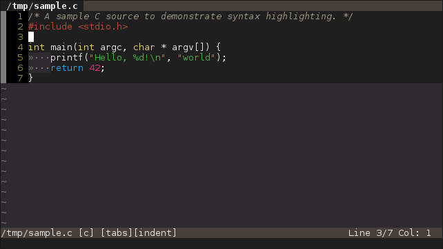

# Bim - A Bad IMitation of Vi(m)

Bim is a terminal text editor with syntax highlighting.

Inspired by Vim and featuring similar mode-based editing, Bim was originally written for ToaruOS, but it has also been tested in Linux, Sortix, FreeBSD, and macOS.

## Goals / Purpose

Bim does not seek to improve or replace vim, or any other text editor. Its goal is to provide ToaruOS-NIH - a hobby operating system built completely from scratch - with a featureful editor. The ability to build and run Bim on other platforms is a secondary feature.

## Features

- Vim-like modal interactions.
- Arrow-key and traditional vi hjkl navigation.
- Syntax highlighting (currently for C, Python, and Makefiles).
- Themes, including 256-color and 24-bit color support.
- Indentation adjustment.
- Multiple editor tabs.
- Basic Unicode support (sufficient for things like Japanese, but not capable of more complex scripts).
- Efficient screen redrawing.
- Terminal support tested in ToaruOS, Sortix, xterm, urxvt, Gnome, XFCE, Linux and FreeBSD consoles, macOS Terminal.app, iTerm2.
- Mouse support in Xterm-like terminals.
- Line selection and yanking.
- Incremental forward search (and backwards find-next).
- Undo/redo stack (experimental, enable with `-O history`)

## Prerequisites

Bim has no external dependencies beyond a functioning C library and sufficient escape code support in the hosting terminal.

### Terminal Support

Unicode support is recommended, but not completely required.

256-color and 24-bit color are optional. The default theme uses only the standard 16 colors.

Scrolling is normally done through `^[[1S` and `^[[1T`, but this can be disabled with the `:noscroll` command.

Mouse support with `^[[?1000h` is available. The alternate screen is used if available with `^[[?1049h`.

## Key Bindings

When in normal mode:

| **Key**     | **Action**                                                                              |
|-------------|-----------------------------------------------------------------------------------------|
| `:`         | Start entering a command                                                                |
| `/`         | Start increment search                                                                  |
| `n`         | Find next search match                                                                  |
| `N`         | Find previous search match                                                              |
| `V`         | Enter LINE SELECTION mode                                                               |
| `R`         | Enter REPLACE mode                                                                      |
| `i`         | Enter INSERT mode                                                                       |
| `a`         | Enter INSERT mode with the cursor after the current position (for appending characters) |
| `O`         | Add line before current line, and enter INSERT mode.                                    |
| `o`         | Add line after current line, and enter INSERT mode.                                     |
| `hjkl`      | Vi-style navigation                                                                     |
| Space       | Scroll down a screenful                                                                 |
| `%`         | Jump to the matching brace/parenthesis                                                  |
| `{`         | Jump to previous blank line                                                             |
| `}`         | Jump to next blank line                                                                 |
| `$`         | Move the cursor to the end of the line                                                  |
| `^` or `0`  | Move the cursor to the beginning of the line                                            |
| `Pp`        | Paste yanked lines, before or after (respectively)                                      |
| `u`         | Undo last block of edits                                                                |
| Ctrl-`R`    | Redo last undone block of edits                                                         |
| Ctrl-`L`    | Repaint the screen                                                                      |

In LINE SELECTION mode the following additional commands are available:

| **Key**     | **Action**                                               |
|-------------|----------------------------------------------------------|
| Tab         | Indent selected lines one indentation unit to the right  |
| Shift-Tab   | Unindent selected lines one indentation unit to the left |
| `d`         | Delete and yank selected lines                           |
| `y`         | Yank selected lines                                      |

Hitting escape will generally exit non-normal modes. In normal, INSERT, LINE SELECTION, and REPLACE modes, arrow keys and page up / page down may also be used for navigation, and home/end will move the cursor to the beginning and ending of lines.

## License

Bim is primarily distributed under the ISC license. In ToaruOS, it is under the NCSA license. The terms are nearly identical from a legal standpoint.

## Development

Bim is still primarily developed alongside ToaruOS-NIH. This repository is a mirror with fake history going back to the start of that project. Pull requests merged here will be patched into [ToaruOS-NIH](https://git.toaruos.org/klange/toaru-nih).
